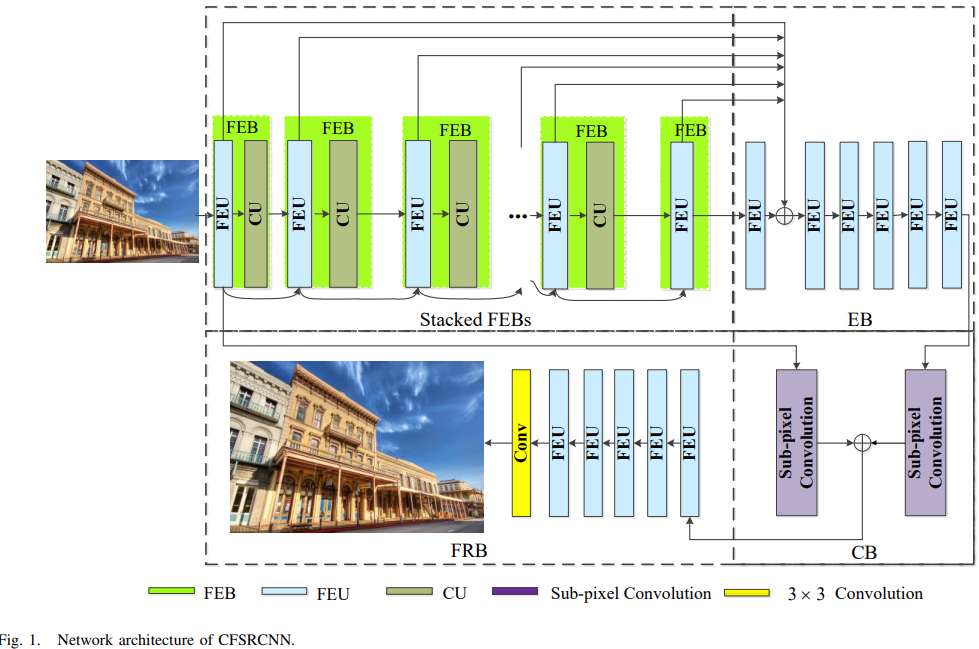
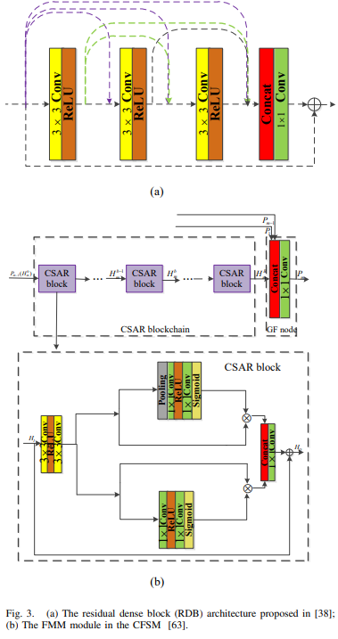
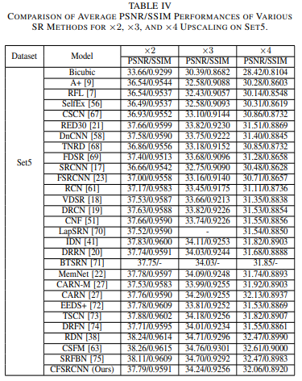
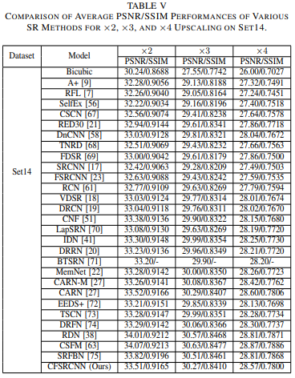
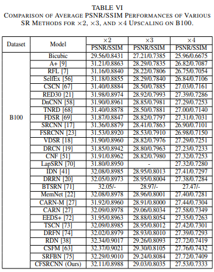
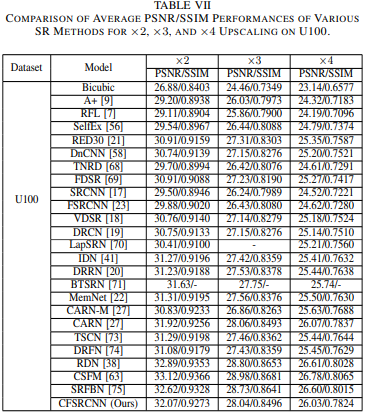
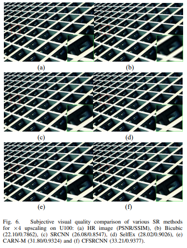

## Coarse-to-Fine CNN for Image Super-Resolution（CFSRCNN）is conducted by Chunwei Tian, Yong Xu, Wangmeng Zuo, Bob Zhang, Lunke Fei and Chia-Wen Lin and is accpted by IEEE Transactions on Multimedia, 2020. It is implemented by Pytorch.

## Absract
#### Deep convolutional neural networks (CNNs) have been popularly adopted in image super-resolution (SR). However, deep CNNs for SR often suffer from the instability of training, resulting in poor image SR performance. Gathering complementary contextual information can effectively overcome the problem. Along this line, we propose a coarse-to-fine SRCNN (CFSRCNN) to recover a high-resolution (HR) image from its low-resolution version. The proposed CFSRCNN consists of a stack of feature extraction blocks (FEBs), an enhancement block (EB), a construction block (CB) and, a feature refinement block (FRB) to learn a robust SR model. Specifically, the stack of FEBs learns the long- and short-path features, and then fuses the learned features by expending the effect of the shallower layers to the deeper layers to improve the representing power of learned features. A compression unit is then used in each FEB to distill important information of features so as to reduce the number of parameters. Subsequently, the EB utilizes residual learning to integrate the extracted features to prevent from losing edge information due to repeated distillation operations. After that, the CB applies the global and local LR features to obtain coarse features, followed by the FRB to refine the features to reconstruct a high-resolution image. Extensive experiments demonstrate the high efficiency and good performance of our CFSRCNN model on benchmark datasets compared with state-of-the-art SR models. The code of CFSRCNN is accessible on https://github.com/hellloxiaotian/CFSRCNN.

## Requirements (Pytorch)  
#### Pytorch 0.41
#### Python 2.7
#### torchvision 
#### openCv for Python
#### HDF5 for Python

### 1. Network architecture of CFSRCNN.

### 2. Architecture of the CFSRCNN.

### 3. (a) The residual dense block (RDB) architecture proposed in [38]; (b) The FMM module in the CFSM [63].

#### 3. CFSRCNN for x2, x3 and x4 on Set5.

#### 4. CFSRCNN for x2, x3 and x4 on Set14.

#### 5. CFSRCNN for x2, x3 and x4 on B100.

#### 6. CFSRCNN for x2, x3 and x4 on U100.

#### 7. Visual results of Set14 for x2.

#### 8. Visual results of B100 for x3.

#### 9. Visual results of U100 for x4.

